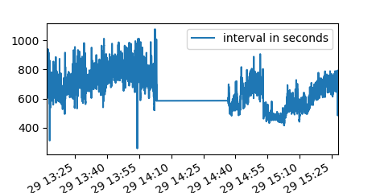

# EliteHRV to Pandas DataFrame
This script takes a text file of RR interval exported from the EliteHRV app and reads it into a Pandas DataFrame as a time series. 




### Getting started
Download or clone the repo, then place your exported data in the data/eliteHRV folder.
To use the script import the module and call the importDriveData() function.
[Indept description of the project is on my blog DataEspresso.com](http://dataespresso.com/en/2017/07/16/reading-rr-intervals-from-elitehrv-with-pandas/)

```
import importhrv as imp
df = imp.importDriveData()
```
The function can take two paramters
* Path
* FileType
```
df = imp.importDriveData('data/eliteHRV/export/', "*.txt")
```
See "eliteHRVReader.py" for example usage. Some demo data is included. 

### Plotting the data as a time series
The DataFrame can be plotted by using normal pandas commands
```
df.reset_index().plot(x="time", y=['interval in seconds'])

```

## Authors

* **Christopher Ottesen** 


## Acknowledgments
Thanks to EliteHRV for their hard work!
* https://elitehrv.com/
